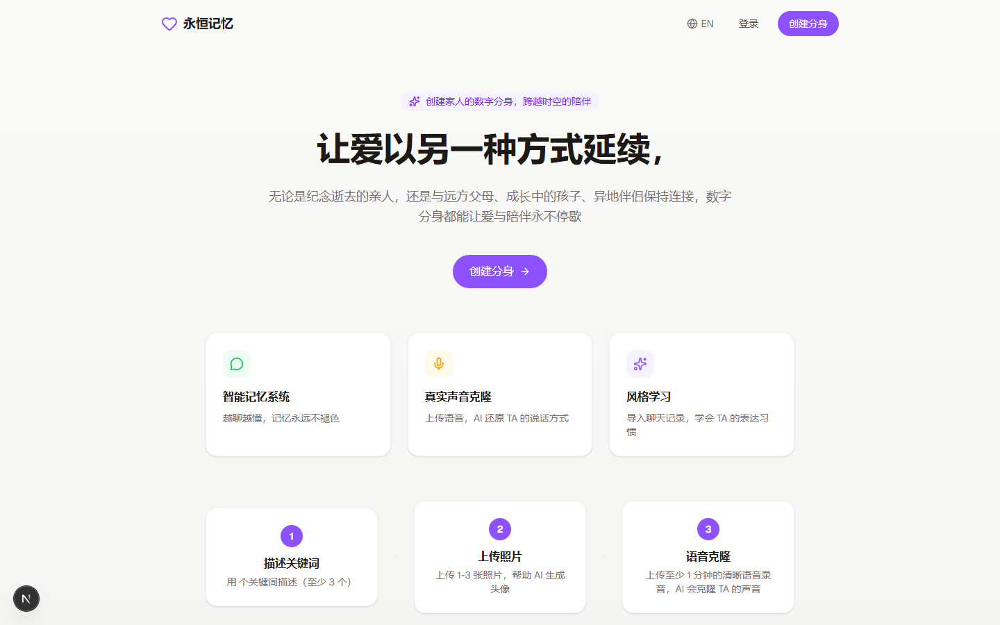
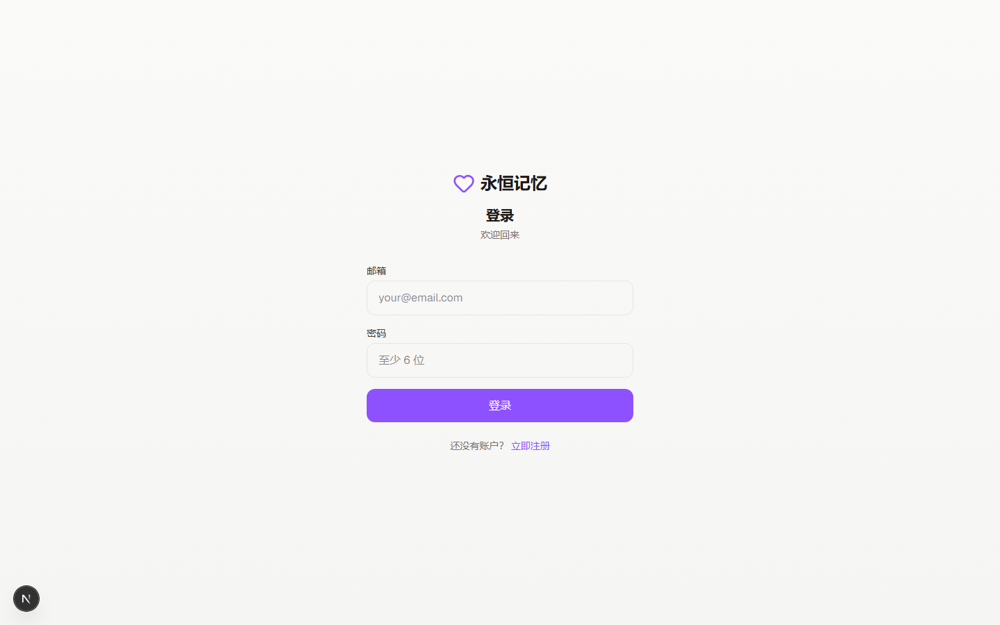
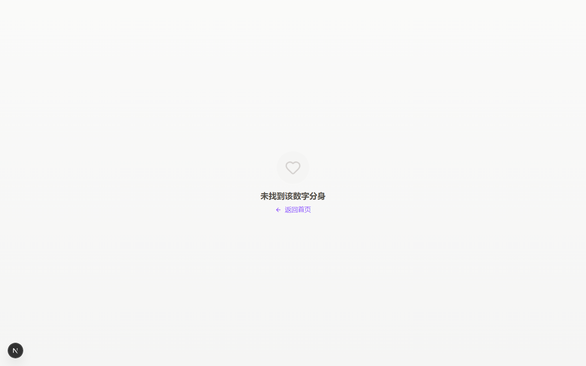

<div align="center">

# Memorial AI

**AI-powered digital memorials — preserve and interact with memories of loved ones.**

Create a digital presence of your loved ones using voice cloning, smart memory, and personality modeling. Have warm conversations that help keep their memory alive.

[](LICENSE)
[](https://nextjs.org/)
[](https://www.typescriptlang.org/)
[](https://supabase.com/)
[](https://www.anthropic.com/)

</div>

---

## Why Memorial AI?

When someone you love passes away, their voice, their stories, and the little things that made them who they are — that's what you miss most. Memorial AI lets you preserve those memories in a way that feels personal and real.

Upload a few audio clips, share some memories, and Memorial AI creates a digital presence that can:
- **Speak in their voice** — cloned from your recordings
- **Remember your shared stories** — automatically extracted from conversations
- **Respond with their personality** — built from just a name and a few keywords
- **Grow over time** — learns more about them the more you talk

It's not about replacing anyone. It's about keeping their memory close.

> [!NOTE]
> Memorial AI is an open-source project. You can self-host it with your own API keys, or use it as a foundation to build your own digital memorial experience.

---

## Screenshots

### Homepage


### Login & Register


### Share Avatar


---

## Features

### Core

- **Character Card** — Structured personality profile (core identity, speech patterns, emotional patterns, relationship dynamics) generated from just a name and a few keywords
- **Smart Memory** — Semantic memory extraction from conversations using OpenAI embeddings + pgvector. Automatically discovers and organizes important memories
- **Voice Cloning** — ElevenLabs TTS integration clones your loved one's voice from audio recordings
- **Emotion Awareness** — Real-time conversation emotion analysis that adjusts voice warmth and suggested tone

### Advanced

- **Style Learning** — Paste real chat history and the AI learns their unique expression habits, catchphrases, and sentence patterns
- **Conversation Summaries** — Auto-generated every 10 turns, injected as context so long conversations stay coherent
- **Personality Evolution** — The character card evolves over time as new memories and stories are discovered through conversation
- **Proactive Messages** — The avatar can initiate topics — birthday memories, emotional check-ins, and recalling important moments

### Technical

- **Streaming Responses** — Server-Sent Events for real-time text streaming
- **i18n** — Chinese and English support via next-intl
- **Docker Support** — Multi-stage Dockerfile and docker-compose for easy self-hosting
- **Row Level Security** — Supabase RLS ensures users can only access their own data

---

## Architecture

```
Frontend:  Next.js 16 + Tailwind CSS 4
LLM:       Claude Sonnet 4 (conversation) + Claude Haiku 4 (emotion / memory / summary)
TTS:       ElevenLabs voice cloning API
Embedding: OpenAI text-embedding-3-small
Database:  Supabase (PostgreSQL + pgvector)
Auth:      Supabase Auth (SSR with @supabase/ssr)
```

### Key Components

| Component | Description |
|-----------|-------------|
| `src/lib/claude.ts` | LLM interface — character card generation, conversation streaming, emotion analysis, memory extraction, conversation summaries |
| `src/lib/voice.ts` | ElevenLabs TTS with voice cloning |
| `src/lib/evolution.ts` | Personality evolution engine — incremental character card patches |
| `src/lib/proactive.ts` | Proactive message generation (birthday, anniversary, emotional check-in) |
| `src/lib/supabase.ts` | Database client, types, and queries |
| `src/app/api/chat/route.ts` | SSE streaming chat API with emotion + memory + evolution pipeline |
| `src/app/api/create/route.ts` | Avatar creation with character card generation |
| `supabase/migrations/` | SQL schema, pgvector index, weighted memory matching functions |

---

## Quick Start

### Prerequisites

- Node.js 18+
- Supabase project (or any PostgreSQL with pgvector)
- Anthropic API key (Claude)
- OpenAI API key (embeddings)
- ElevenLabs API key (voice cloning, optional)

### 1. Clone and install

```bash
git clone https://github.com/logi-cmd/memorial-ai.git
cd memorial-ai
npm install
```

### 2. Set up database

Run the Supabase migrations in order:

```
supabase/migrations/001_initial_schema.sql
supabase/migrations/002_embedding_index.sql
supabase/migrations/003_memory_fixes.sql
supabase/migrations/004_character_card.sql
supabase/migrations/005_*.sql
supabase/migrations/006_*.sql
supabase/migrations/007_*.sql
supabase/migrations/008_*.sql
```

### 3. Configure environment

```bash
cp .env.example .env
```

Fill in your API keys:

```env
# Supabase
NEXT_PUBLIC_SUPABASE_URL=https://your-project.supabase.co
NEXT_PUBLIC_SUPABASE_ANON_KEY=your-anon-key

# Anthropic Claude API
ANTHROPIC_API_KEY=sk-ant-...

# OpenAI (Embedding)
OPENAI_API_KEY=sk-...

# ElevenLabs (Voice, optional)
ELEVENLABS_API_KEY=...

# App
NEXT_PUBLIC_APP_URL=http://localhost:3000
```

### 4. Run

```bash
npm run dev
```

Open [http://localhost:3000](http://localhost:3000).

---

## Docker

```bash
# Build
docker build -t memorial-ai .

# Run
docker run -p 3000:3000 --env-file .env memorial-ai
```

Or use docker-compose:

```bash
docker compose up -d
```

---

## Environment Variables

| Variable | Required | Description |
|----------|----------|-------------|
| `NEXT_PUBLIC_SUPABASE_URL` | Yes | Supabase project URL |
| `NEXT_PUBLIC_SUPABASE_ANON_KEY` | Yes | Supabase anon key |
| `ANTHROPIC_API_KEY` | Yes | Anthropic Claude API key |
| `OPENAI_API_KEY` | Yes | OpenAI API key (embeddings) |
| `ELEVENLABS_API_KEY` | No | ElevenLabs API key (voice cloning) |
| `NEXT_PUBLIC_APP_URL` | No | App URL (default: `http://localhost:3000`) |

---

## Tech Stack

- **[Next.js 16](https://nextjs.org/)** — App Router, Server Actions, Streaming
- **[Tailwind CSS 4](https://tailwindcss.com/)** — Utility-first styling
- **[Supabase](https://supabase.com/)** — PostgreSQL + pgvector for vector similarity search
- **[Anthropic Claude](https://www.anthropic.com/)** — Sonnet 4 for conversations, Haiku 4 for analysis tasks
- **[ElevenLabs](https://elevenlabs.io/)** — Voice cloning and TTS
- **[OpenAI](https://openai.com/)** — text-embedding-3-small for semantic memory matching
- **[next-intl](https://next-intl.dev/)** — Internationalization (zh/en)

---

## How It Works

### Creating an Avatar

1. Enter their name, relationship to you, and a few personality keywords
2. Optionally upload audio clips for voice cloning
3. Answer a personality questionnaire (10 questions across 5 categories)
4. Memorial AI generates a structured Character Card that defines their personality

### Having a Conversation

1. The AI retrieves relevant memories from past conversations (weighted RAG)
2. The character card is injected as the system prompt for consistent personality
3. As you talk, new memories are automatically extracted and stored
4. Every 10 turns, a conversation summary is generated for context compression
5. Real-time emotion analysis adjusts the voice output warmth

### Personality Evolution

The character card isn't static. Over time, as new stories and details emerge from conversations, the personality profile evolves — adding new traits, updating speech patterns, and deepening the relationship model.

---

## Contributing

Contributions are welcome. Please read the [CONTRIBUTING.md](CONTRIBUTING.md) guide before submitting a pull request.

1. Fork the repository
2. Create your feature branch (`git checkout -b feature/amazing-feature`)
3. Commit your changes (`git commit -m 'Add amazing feature'`)
4. Push to the branch (`git push origin feature/amazing-feature`)
5. Open a Pull Request

---

## License

This project is licensed under the [AGPL-3.0-or-later License](LICENSE).

---

<div align="center">

Built with care. In memory of those we love.

</div>
