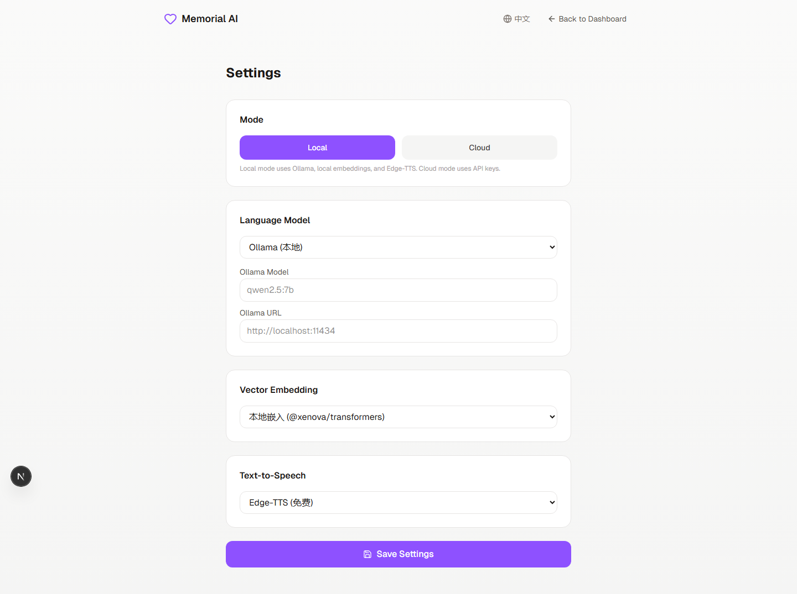

<div align="center">

# Memorial AI

**AI-powered digital avatars — preserve memories of loved ones, completely offline.**

Create a digital presence of your loved ones using local AI. Voice cloning, smart memory, and personality modeling — all running on your own machine, no cloud required.

[](LICENSE)
[](https://nextjs.org/)
[](https://www.typescriptlang.org/)
[](https://ollama.com/)
[](https://www.sqlite.org/)
[](https://github.com/logi-cmd/memorial-ai/actions)

</div>

---

## Why Memorial AI?

When someone you love passes away, their voice, their stories, and the little things that made them who they are — that's what you miss most. Memorial AI lets you preserve those memories in a way that feels personal and real.

Upload a few audio clips, share some memories, and Memorial AI creates a digital presence that can:
- **Speak in their voice** — cloned from your recordings
- **Remember your shared stories** — automatically extracted from conversations
- **Respond with their personality** — built from just a name and a few keywords
- **Grow over time** — learns more about them the more you talk

It's not about replacing anyone. It's about keeping their memory close.

> [!IMPORTANT]
> **100% Local-First.** Memorial AI runs entirely on your machine by default. No cloud services, no API keys, no data leaves your device. You own everything.

---

## Screenshots

### Homepage


### Settings


### Share Avatar


---

## Features

### Core

- **Character Card** — Structured personality profile generated from just a name and a few keywords
- **Smart Memory** — Semantic memory extraction with local embeddings. Automatically discovers and organizes important memories
- **Voice Cloning** — Clone your loved one's voice from audio recordings
- **Emotion Awareness** — Real-time conversation emotion analysis

### Advanced

- **Style Learning** — Paste real chat history and the AI learns their unique expression habits
- **Conversation Summaries** — Auto-generated for context compression
- **Personality Evolution** — The character card evolves over time as new stories emerge
- **Proactive Messages** — The avatar can initiate topics — birthday memories, emotional check-ins
- **Avatar Sharing** — Share public avatar cards with family and friends

### Local-First Architecture

- **No Auth Required** — Start using immediately, no login needed
- **Ollama LLM** — Run any model locally (Qwen2.5, Llama3, Mistral, etc.)
- **Local Embeddings** — @xenova/transformers, zero external dependencies
- **Edge-TTS** — Free Microsoft neural voices, no API key
- **SQLite Storage** — All data on your machine, portable database file
- **Optional Cloud Mode** — Switch to API keys anytime for higher quality

---

## Architecture

```
Local Mode (default):
  Frontend:  Next.js 16 + Tailwind CSS 4
  LLM:       Ollama (qwen2.5, llama3, mistral, etc.)
  TTS:       Edge-TTS (Microsoft neural voices)
  Embedding: @xenova/transformers (all-MiniLM-L6-v2)
  Database:  SQLite (better-sqlite3)
  Auth:      None (local-first)

Cloud Mode (optional):
  LLM:       Anthropic Claude
  TTS:       ElevenLabs
  Embedding: OpenAI text-embedding-3-small
  Database:  Supabase PostgreSQL
  Auth:      Supabase Auth
```

### Key Components

| Component | Description |
|-----------|-------------|
| `src/lib/db.ts` | SQLite database layer — all CRUD operations |
| `src/lib/providers/ollama.ts` | Ollama LLM provider with streaming |
| `src/lib/providers/local-embedding.ts` | Local vector embeddings |
| `src/lib/providers/edge-tts.ts` | Edge-TTS text-to-speech |
| `src/lib/providers/config.ts` | Provider mode configuration |
| `src/lib/claude.ts` | Cloud LLM fallback (Anthropic) |
| `src/app/api/chat/route.ts` | SSE streaming chat API |
| `src/app/settings/page.tsx` | Settings UI for mode switching |

---

## Quick Start

### Option A: Local Mode (Recommended)

**Prerequisites:**
- Node.js 18+
- [Ollama](https://ollama.com/) installed and running

**Steps:**

```bash
# 1. Clone and install
git clone https://github.com/logi-cmd/memorial-ai.git
cd memorial-ai
npm install

# 2. Start Ollama and pull a model
ollama pull qwen2.5:7b

# 3. Run the app
npm run dev
```

Open [http://localhost:3000](http://localhost:3000). No API keys needed!

**Default local config:**
- LLM: `qwen2.5:7b` via `http://localhost:11434`
- Embedding: Local `all-MiniLM-L6-v2`
- TTS: Edge-TTS (free)
- Database: `~/.memorial-ai/memorial-ai.db`

### Option B: Cloud Mode

```bash
# 1. Clone and install
git clone https://github.com/logi-cmd/memorial-ai.git
cd memorial-ai
npm install

# 2. Configure environment
cp .env.example .env

# 3. Set mode to cloud
APP_MODE=cloud

# 4. Fill in API keys
ANTHROPIC_API_KEY=sk-ant-...
OPENAI_API_KEY=sk-...
ELEVENLABS_API_KEY=...

# 5. Run
npm run dev
```

### Docker

```bash
# Build
docker build -t memorial-ai .

# Run
docker run -p 3000:3000 --env-file .env memorial-ai
```

---

## Environment Variables

### Local Mode (default, zero config)

| Variable | Default | Description |
|----------|---------|-------------|
| `APP_MODE` | `local` | Run mode: `local` or `cloud` |
| `OLLAMA_BASE_URL` | `http://localhost:11434` | Ollama API URL |
| `OLLAMA_MODEL` | `qwen2.5:7b` | Ollama model name |

### Cloud Mode

| Variable | Required | Description |
|----------|----------|-------------|
| `APP_MODE` | No | Set to `cloud` to enable |
| `ANTHROPIC_API_KEY` | For LLM | Anthropic Claude API key |
| `OPENAI_API_KEY` | For embeddings | OpenAI API key |
| `ELEVENLABS_API_KEY` | For TTS | ElevenLabs API key |
| `NEXT_PUBLIC_SUPABASE_URL` | For DB | Supabase project URL |
| `NEXT_PUBLIC_SUPABASE_ANON_KEY` | For DB | Supabase anon key |

---

## Tech Stack

- **[Next.js 16](https://nextjs.org/)** — App Router, Streaming, Server Components
- **[Tailwind CSS 4](https://tailwindcss.com/)** — Utility-first styling
- **[Ollama](https://ollama.com/)** — Local LLM inference
- **[better-sqlite3](https://github.com/WiseLibs/better-sqlite3)** — Local database
- **[@xenova/transformers](https://github.com/xenova/transformers)** — Local embeddings
- **[node-edge-tts](https://github.com/nicholasgriffintn/node-edge-tts)** — Free TTS
- **[Anthropic Claude](https://www.anthropic.com/)** — Cloud LLM fallback
- **[OpenAI](https://openai.com/)** — Cloud embedding fallback
- **[next-intl](https://next-intl.dev/)** — Internationalization (zh/en)
- **[Vitest](https://vitest.dev/)** — Unit testing (99 tests)

---

## How It Works

### Creating an Avatar

1. Enter their name, relationship to you, and a few personality keywords
2. Optionally upload audio clips for voice cloning
3. Answer a personality questionnaire (10 questions across 5 categories)
4. Memorial AI generates a structured Character Card that defines their personality

### Having a Conversation

1. The AI retrieves relevant memories from past conversations (local vector search)
2. The character card is injected as the system prompt for consistent personality
3. As you talk, new memories are automatically extracted and stored
4. Conversation summaries are generated for context compression
5. Real-time emotion analysis adjusts the voice output

### Personality Evolution

The character card isn't static. Over time, as new stories and details emerge from conversations, the personality profile evolves — adding new traits, updating speech patterns, and deepening the relationship model.

---

## Contributing

Contributions are welcome. Please read the [CONTRIBUTING.md](CONTRIBUTING.md) guide before submitting a pull request.

1. Fork the repository
2. Create your feature branch (`git checkout -b feature/amazing-feature`)
3. Commit your changes (`git commit -m 'Add amazing feature'`)
4. Push to the branch (`git push origin feature/amazing-feature`)
5. Open a Pull Request

---

## License

This project is licensed under the [AGPL-3.0-or-later License](LICENSE).

---

<div align="center">

Built with care. In memory of those we love.

</div>
